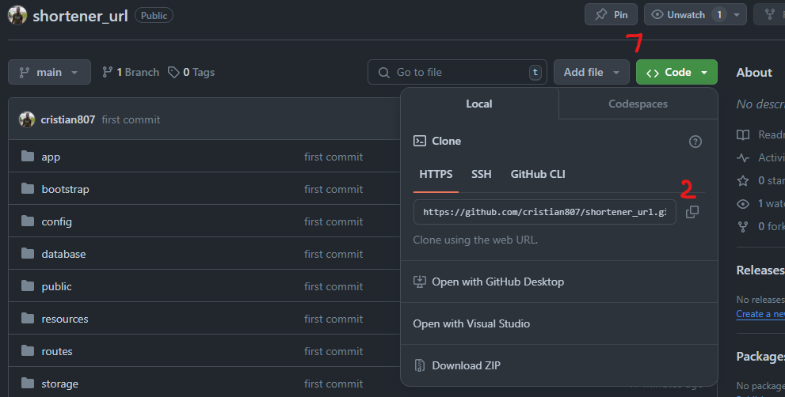
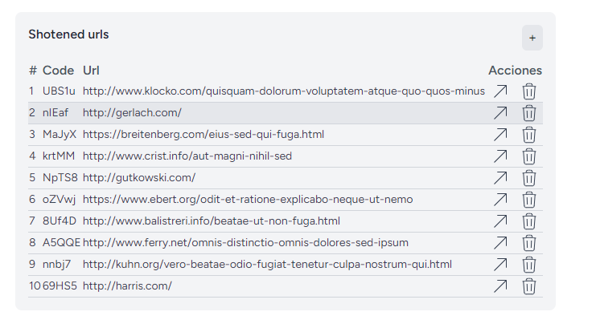

<p align="center">
    
</p>


# Shorteners URLs

Shorteners url es un proyecto realizado con laravel V10 y react el cual te permite acortar URLs muy extensas y esta te proporciona una URL pequeña que al ingresar a esta te redirige a la URL origen.

# Instalacion

## Requisitos
    1. PHP 8.1 - 8.3
    2. NODE V17 o superior
    3. composer 2.4
    4. Mysql

Una vez se cumplan los requisitos procedemos a clonar el repositorio



1. abrimos nuestra terminal(consola), nos ubicamos en la carpeta que queremos que se nos descargen los archivos y copiamos el comando del paso 2 en la imagen anterior.

```
git clone https://github.com/cristian807/shortener_url.git
```

2. abrimos el proyecto con nuestro editor preferido y ejecutamos los siguientes comandos:

Instalamos las dependencias del archivo composer.json
```
composer install
```

Instalamos las dependencias del archivo package.json
```
npm install
```

creamos el archivo .env basandonos en el .env.example

```
cp .env.example .env
```

creamos nuestra base de datos a utilizar y la referenciamos en el archivo .env 

Ejecutamos las migraciones y seeders

```
php artisan migrate --seed
```
Generamos la nueva key para nustra aplicacion

```
php artisan key:generate
```

Levantamos nuestro servidor

```
php artisan serve && npm run dev
```
Cuando nuestro servidor este listo podemos ingresar desde el navegador a nuestra pagina (http://127.0.0.1:8000/)

<p align="center">
    
</p>

## Documentacion con Swagger

(http://127.0.0.1:8000/api/documentation)
